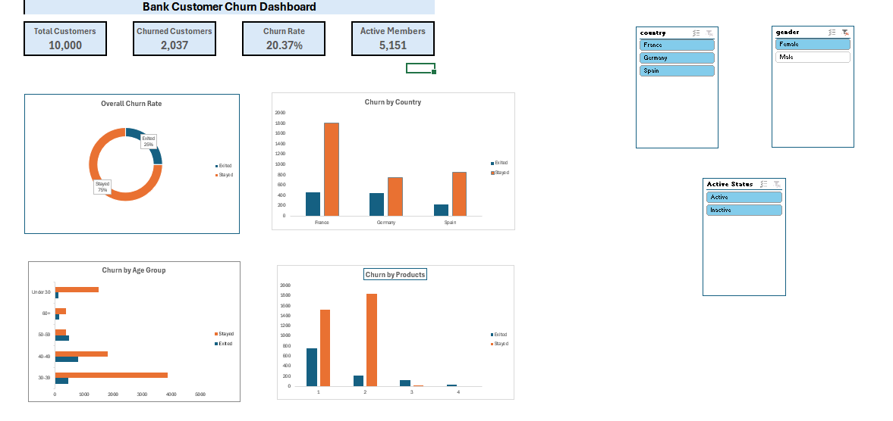
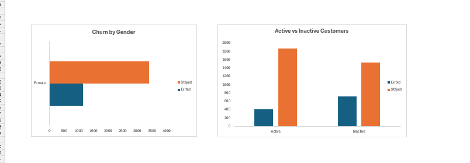

# Bank Customer Churn Analysis Dashboard (Excel)

Interactive Bank Customer Churn Dashboard built in Microsoft Excel using Pivot Tables, Pivot Charts, KPIs, and Slicers.

## Project Overview

This project analyzes customer churn using Microsoft Excel. The goal is to identify the factors that influence customer attrition and present actionable business insights through an interactive dashboard.

---

##  Objectives

- Analyze customer churn trends
- Identify high-risk customer segments
- Compare churn across countries, age groups, gender, products, and activity status
- Build an interactive dashboard using Pivot Tables, Pivot Charts, and Slicers

---

##  Tools Used

- Microsoft Excel
- Pivot Tables
- Pivot Charts
- Slicers
- Conditional Formatting
- Data Cleaning
- Dashboard Design

---

##  Dataset

**Source:** Kaggle – Bank Customer Churn Dataset

Dataset contains **10,000 customers** with features including:

- Credit Score
- Country
- Gender
- Age
- Tenure
- Balance
- Products
- Credit Card
- Active Member
- Estimated Salary
- Churn Status

---

##  Dashboard Preview
# 📊 Bank Customer Churn Analysis Dashboard

  

# 📊 Bank Customer Churn Analysis Dashboard

  

##  Key Findings

- Overall churn rate is **20.37%**
- Germany has the highest churn rate (**32%**)
- Female customers churn more than male customers
- Inactive members churn significantly more than active members
- Customers aged **50–59** have the highest churn rate
- Customers with **2 products** have the lowest churn rate

---

##  Skills Demonstrated

- Data Cleaning
- Exploratory Data Analysis (EDA)
- Business Analysis
- KPI Development
- Dashboard Design
- Data Visualization
- Excel Reporting

---

##  Future Improvements

- Build the dashboard in Power BI
- Perform predictive churn analysis using Python
- Create SQL queries for customer segmentation

---

## Author

**Dania Irfan**

Business Data Analytics Student

COMSATS University Islamabad
